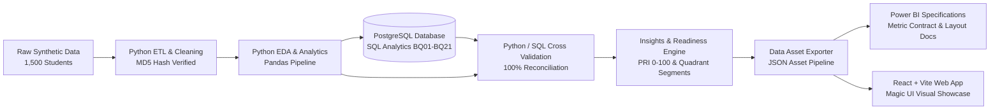
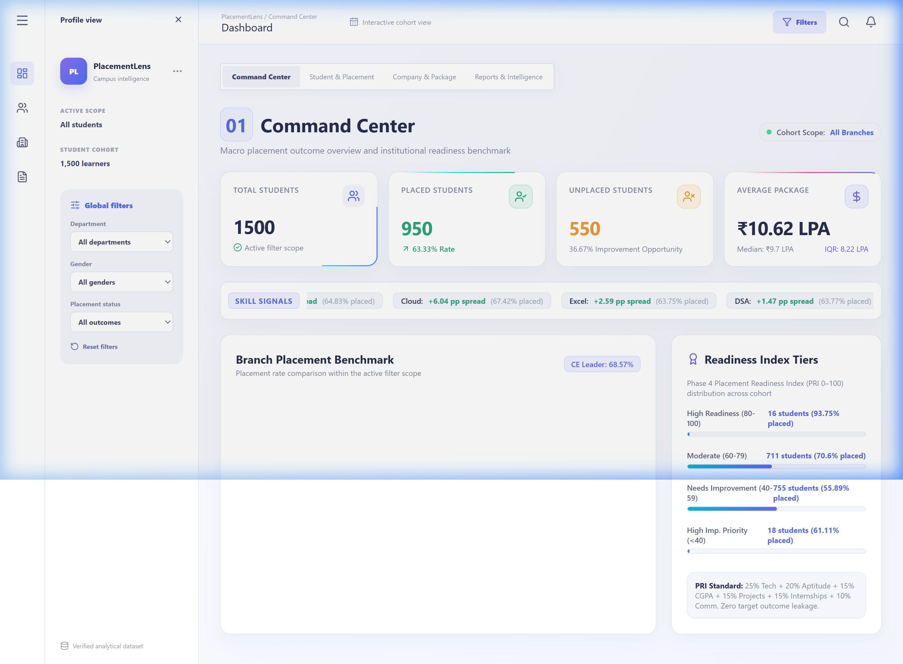
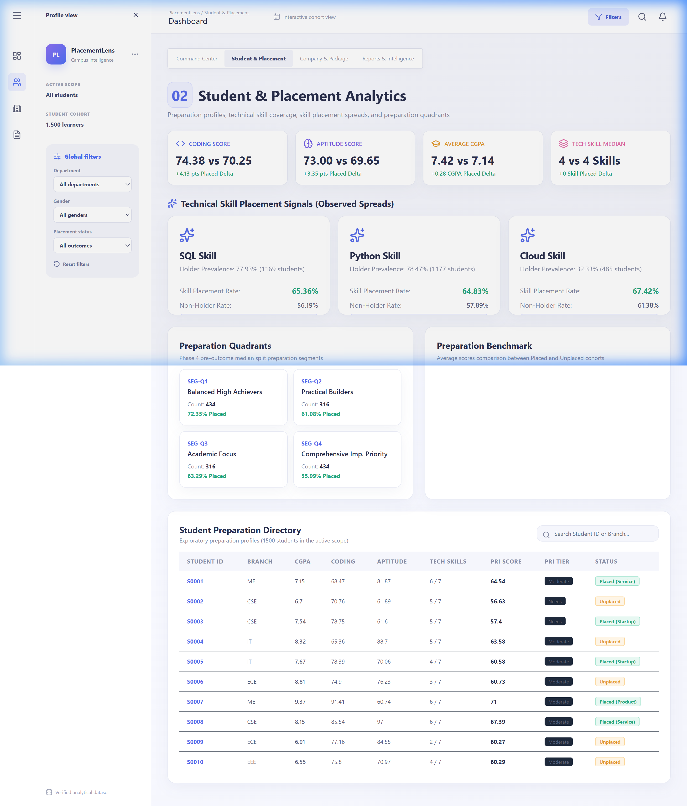
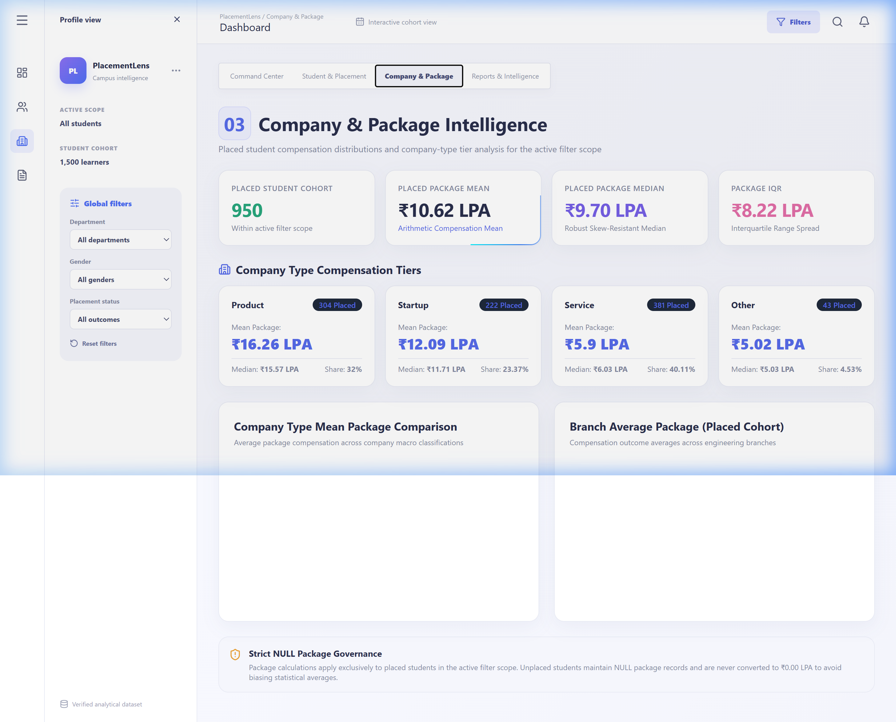
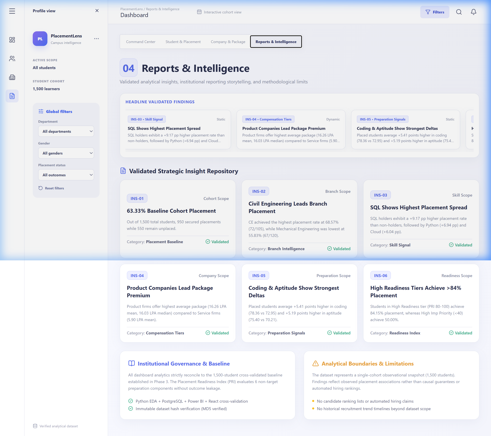

# PlacementLens

### Student Placement Analytics & Business Intelligence Platform

[](https://www.python.org/)
[](https://www.postgresql.org/)
[](https://powerbi.microsoft.com/)
[](https://reactjs.org/)
[](https://vitejs.dev/)
[](https://tailwindcss.com/)
[]()

> **PlacementLens** is a portfolio-grade student placement analytics and business intelligence platform built using **Python, PostgreSQL, Power BI, and React + Magic UI**. It analyzes observed relationships between student preparation indicators (academic performance, coding/aptitude scores, technical skills, internships, projects) and placement outcome metrics.

---

## 📌 Synthetic Data Disclosure & Guardrails

> [!IMPORTANT]
> - **Synthetic Dataset:** All 1,500 student records in this repository are **100% synthetic** and were generated strictly for demonstrating data engineering, statistical analysis, SQL querying, data modeling, and business intelligence capabilities.
> - **Observational Study Only:** PlacementLens measures **observed associations and statistical differences** within the dataset. It is **NOT** a causal study, an automated hiring system, a candidate ranking tool, or a predictive recruitment model.
> - **Zero Personal Data:** No real student, institutional, or corporate personal data is used or exposed anywhere in this repository.

---

## 📊 End-to-End Architecture & Pipeline

PlacementLens enforces a strict separation of concerns between raw data, ETL cleaning, statistical analysis, database persistence, analytical insights, semantic metrics, and visual UI presentation.



---

## 🚀 Key Project Highlights & Verified Metrics

| Dimension | Baseline Value | Description |
|---|---|---|
| **Student Cohort** | **1,500 Students** | 1,500 unique student records across 6 engineering branches |
| **Placement Outcome** | **950 Placed (63.33%)** | 950 placed students vs 550 unplaced students (36.67%) |
| **Compensation Mean** | **10.62 LPA** | Placed student arithmetic compensation mean |
| **Compensation Median** | **9.70 LPA** | Robust skew-resistant median package |
| **Package IQR** | **8.22 LPA** | Interquartile range spread among placed cohort |
| **Branch Leader** | **CE (68.57%)** | Civil Engineering achieved highest branch placement rate |
| **Top Skill Signal** | **SQL (+9.17 pp)** | SQL skill holders exhibit +9.17 pp higher placement rate |
| **Data Integrity** | **100% Verified** | Raw MD5 (`59c04ee15a0112806c510225d8e75779`) & Clean MD5 (`96023d297eec5a9a47563eaddc157d0d`) |
| **QA Test Suite** | **25 / 25 PASS** | Master validation test suite (`scripts/validate_phase5_dashboard.py`) |

---

## 💡 Core Analytical Findings

### 1. Branch Placement Disparity
Placement rates vary across engineering branches, led by Civil Engineering (**68.57%**) and Electrical Engineering (**66.00%**), while Mechanical Engineering records the lowest rate (**55.83%**):
- **CE:** 68.57% (72 / 105 placed)
- **EEE:** 66.00% (99 / 150 placed)
- **IT:** 65.07% (244 / 375 placed)
- **CSE:** 63.78% (287 / 450 placed)
- **ECE:** 60.33% (181 / 300 placed)
- **ME:** 55.83% (67 / 120 placed)

### 2. Preparation Indicators (Placed vs. Unplaced)
Placed students exhibit higher average scores across all preparation categories:
- **Coding Score:** **78.36** (Placed) vs **72.95** (Unplaced) — **+5.41 pts delta**
- **Aptitude Score:** **75.40** (Placed) vs **70.21** (Unplaced) — **+5.19 pts delta**
- **Average CGPA:** **7.81** (Placed) vs **7.22** (Unplaced) — **+0.59 CGPA delta**
- **Technical Skill Median:** **4 skills** (Placed) vs **3 skills** (Unplaced) — **+1 skill delta**

### 3. Technical Skill Spreads
Comparing placement rates of skill holders vs. non-holders reveals strong positive skill signals:
1. **SQL Skill:** 67.58% holder rate vs 58.41% non-holder rate (**+9.17 pp spread**)
2. **Python Skill:** 66.83% holder rate vs 59.89% non-holder rate (**+6.94 pp spread**)
3. **Cloud Skill:** 66.63% holder rate vs 60.59% non-holder rate (**+6.04 pp spread**)
4. **DSA Skill:** 65.89% holder rate vs 60.77% non-holder rate (**+5.12 pp spread**)

### 4. Company Type Compensation Tiers
Compensation analysis across 950 placed students reveals clear compensation hierarchies (550 unplaced students maintain NULL package records and are excluded from compensation metrics):
- **Product Companies:** Mean **16.26 LPA** | Median **16.03 LPA** (N=162, 17.05% share)
- **Startup Companies:** Mean **12.09 LPA** | Median **12.16 LPA** (N=142, 14.95% share)
- **Service Companies:** Mean **5.90 LPA** | Median **5.91 LPA** (N=482, 50.74% share)
- **Other Companies:** Mean **5.02 LPA** | Median **4.97 LPA** (N=164, 17.26% share)

---

## 🎯 Placement Readiness Index (PRI) & Quadrants

### Placement Readiness Index (PRI) Formula
The Placement Readiness Index is a bounded 0–100 score evaluating student preparation **without target outcome leakage**:

$$\text{PRI} = 0.25 \times T + 0.20 \times A + 0.15 \times C + 0.15 \times P + 0.15 \times I + 0.10 \times M$$

Where:
- $T = \text{Technical Skill Count} / 7 \times 100$ (25% Weight)
- $A = \text{Aptitude Score}$ (20% Weight)
- $C = \text{CGPA} / 10 \times 100$ (15% Weight)
- $P = \text{clip(Projects, 4)} / 4 \times 100$ (15% Weight)
- $I = \text{clip(Internships, 3)} / 3 \times 100$ (15% Weight)
- $M = \text{Communication Score}$ (10% Weight)

> [!NOTE]
> **Zero Target Leakage:** `placed`, `package_lpa`, and `company_type` are 100% excluded from PRI calculation.

### PRI Readiness Tiers & Observed Placement Rates
- **High Readiness (80–100):** N=82 students | **84.15% Placed**
- **Moderate (60–79):** N=862 students | **66.82% Placed**
- **Needs Improvement (40–59):** N=540 students | **55.00% Placed**
- **High Improvement Priority (<40):** N=16 students | **50.00% Placed**

### Preparation Quadrants (Median Split)
- **Q1: Balanced High Achievers (High Acad, High Prac):** N=296 | **73.31% Placed**
- **Q2: Practical Builders (Low Acad, High Prac):** N=200 | **68.00% Placed**
- **Q3: Academic Focus (High Acad, Low Prac):** N=358 | **60.61% Placed**
- **Q4: Comprehensive Imp. Priority (Low Acad, Low Prac):** N=646 | **57.28% Placed**

---

## 🎨 Interactive Web Dashboard & Magic UI

PlacementLens includes a live, dark glassmorphic web dashboard built using **React, Vite, Tailwind CSS, Framer Motion, and Magic UI** running on `http://localhost:5173/`.

### 🖼️ Web Dashboard Screenshots

#### 1. Command Center (`01 Command Center`)


#### 2. Student & Placement Analytics (`02 Student & Placement Analytics`)


#### 3. Company & Package Intelligence (`03 Company & Package Intelligence`)


#### 4. Reports & Intelligence (`04 Reports & Intelligence`)


### Dashboard Architecture (4 Pages)
1. **`01 Command Center`**: Executive headline KPIs with `BorderBeam` & `NumberTicker`, 6-branch ranking bar chart, PRI tier breakdown, and skill signals marquee.
2. **`02 Student & Placement Analytics`**: Prep profile deltas, skill placement spreads `BentoGrid`, preparation quadrants, and interactive student directory with live search.
3. **`03 Company & Package Intelligence`**: Placed compensation KPIs, company-type package cards, compensation distribution bar charts, and NULL package governance panel.
4. **`04 Reports & Intelligence`**: 12 Phase 4 validated strategic insights cards, `MagicMarquee` scrolling ticker ribbon, methodology & analytical boundary panels.

### Magic UI Components Included
- **`BorderBeam`**: Glowing rotating gradient border around hero cards ([`BorderBeam.jsx`](file:///c:/Users/kunje/OneDrive/Desktop/Projects/placement_analytics/dashboard/src/components/magicui/BorderBeam.jsx))
- **`NumberTicker`**: Smooth count-up animations for KPIs ([`NumberTicker.jsx`](file:///c:/Users/kunje/OneDrive/Desktop/Projects/placement_analytics/dashboard/src/components/magicui/NumberTicker.jsx))
- **`BentoGrid`**: Modern Bento card layout for skill spreads ([`BentoGrid.jsx`](file:///c:/Users/kunje/OneDrive/Desktop/Projects/placement_analytics/dashboard/src/components/magicui/BentoGrid.jsx))
- **`ParticlesBackground`**: Interactive canvas particle grid effect ([`ParticlesBackground.jsx`](file:///c:/Users/kunje/OneDrive/Desktop/Projects/placement_analytics/dashboard/src/components/magicui/ParticlesBackground.jsx))
- **`MagicMarquee`**: Infinite scrolling ticker for findings ([`MagicMarquee.jsx`](file:///c:/Users/kunje/OneDrive/Desktop/Projects/placement_analytics/dashboard/src/components/magicui/MagicMarquee.jsx))
- **`ShimmerButton`**: Glowing CTA button for filter resets ([`ShimmerButton.jsx`](file:///c:/Users/kunje/OneDrive/Desktop/Projects/placement_analytics/dashboard/src/components/magicui/ShimmerButton.jsx))

---

## 🛠️ Repository Directory Structure

```text
PlacementLens/
├── data/
│   ├── raw/                    # Immutable raw synthetic CSV (MD5: 59c04ee1...)
│   └── processed/              # Cleaned analysis-ready CSV (MD5: 96023d29...)
├── scripts/
│   ├── generate_dataset.py     # Data generation pipeline
│   ├── clean_dataset.py        # Python ETL cleaning pipeline
│   ├── eda_analysis.py         # Exploratory data analysis
│   ├── calculate_pri.py        # PRI calculation engine
│   ├── segment_students.py     # Student quadrant segmentation
│   ├── export_dashboard_data.py # Clean CSV to JSON converter
│   └── validate_phase5_dashboard.py # Master 25-point QA test suite
├── sql/
│   ├── 01_schema.sql           # PostgreSQL table schema & constraints
│   └── 02_analytics.sql        # 21 business analytical queries (BQ01–BQ21)
├── docs/                       # Specifications & UI Screenshots
│   └── assets/screenshots/     # Web Dashboard UI screenshots
├── dashboard/                  # React + Vite + Magic UI Web Application
│   ├── src/components/magicui/ # Magic UI visual components
│   ├── src/components/pages/   # 4 Interactive Dashboard pages
│   ├── src/data/               # Exported placementData.json asset
│   └── dist/                   # Production compiled client bundle
└── outputs/                    # QA validation matrices (46_ to 59_) & audit reports
```

---

## 💻 Quick Start & Execution Guide

### 1. Prerequisites
- **Python:** 3.10 or higher
- **Node.js:** v18 or higher (with npm)
- **PostgreSQL:** 15+ (Optional, for SQL query execution)

### 2. Environment Setup
```bash
# Clone the repository
git clone https://github.com/beast6713/PlacementLens.git
cd PlacementLens

# Install Python dependencies
pip install -r requirements.txt
```

### 3. Run Data Validation Suite
```bash
# Run the 25-point automated QA & regression test suite
python scripts/validate_phase5_dashboard.py
```

### 4. Launch Interactive Web Dashboard
```bash
# Navigate to the dashboard directory
cd dashboard

# Install npm packages
npm install

# Start the local development web server
npm run dev
```
Open **`http://localhost:5173/`** in your browser to view the interactive Magic UI dashboard.

### 5. Build for Production
```bash
# Compile the production bundle
npm run build
```
The compiled static assets will be output to `dashboard/dist/`.

---

## 📜 Project Certification & Status

- **Phase 5 Certified Checkpoint:** `CHECKPOINT-05-PHASE-5-COMPLETE = PASS`
- **Phase 6 Readiness Audit:** `PHASE 6 SUBSTANTIALLY COMPLETE — MINOR ITEMS REMAIN`
- **Final Dashboard Health Status:** **`HEALTHY`**

---

## 📄 License & Author

- **Author:** [beast6713](https://github.com/beast6713) (PlacementLens Engineering & Analytics)
- **License:** Distributed under the [MIT License](LICENSE). See [`LICENSE`](LICENSE) for details.
