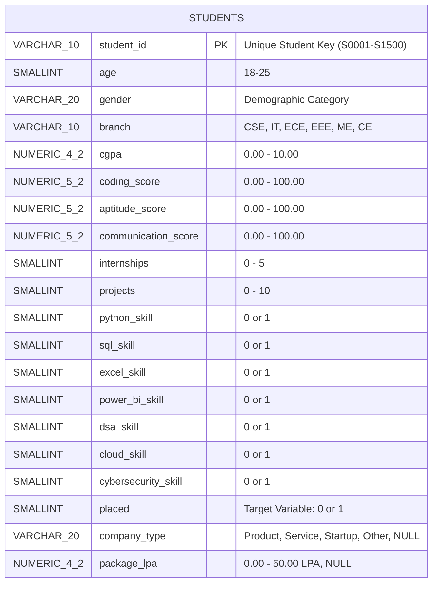
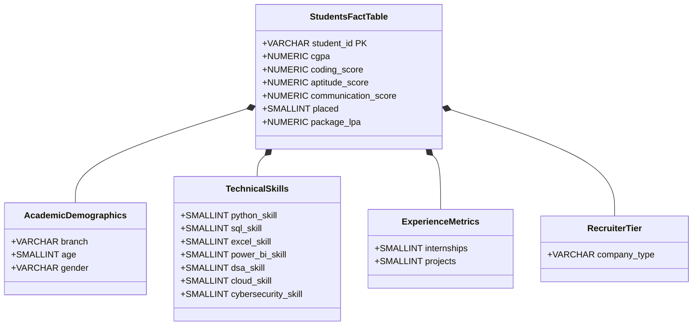
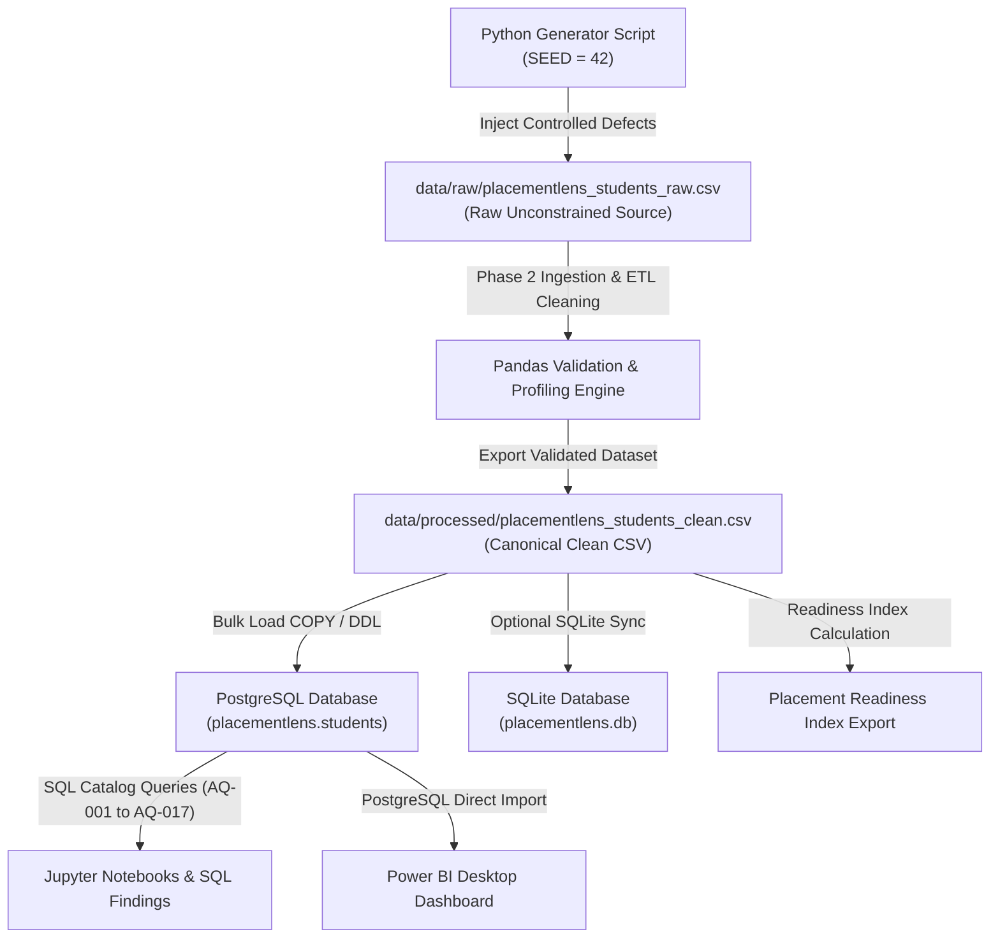

# Entity Relationship & Data Flow Specification

## 1. Physical Database Model (PostgreSQL)

The primary database architecture for PlacementLens (`placementlens`) consists of the canonical analytical table `public.students`.

---

## 2. Power BI Tabular & Logical Dimension Architecture

For visualization and interactive reporting in Power BI Desktop, `public.students` serves as the primary Fact / Analytical table. Logical dimension groupings are mapped cleanly without requiring physical table splitting:

---

## 3. End-to-End Data Lineage Architecture

---

## 4. Key Relationships & Integrity Rules

- **Primary Key:** `students.student_id` is unique, non-null, and immutable across the data pipeline.
- **Cardinally:** 1 row = 1 student record (1,500 total rows).
- **Referential Actions:** No child foreign key tables exist in the baseline canonical model, eliminating orphan record risks.
- **Table Constraint:**
  $$\text{placed} = 0 \iff (\text{company\_type IS NULL} \land \text{package\_lpa IS NULL})$$
  $$\text{placed} = 1 \iff (\text{company\_type IS NOT NULL} \land \text{package\_lpa IS NOT NULL})$$
